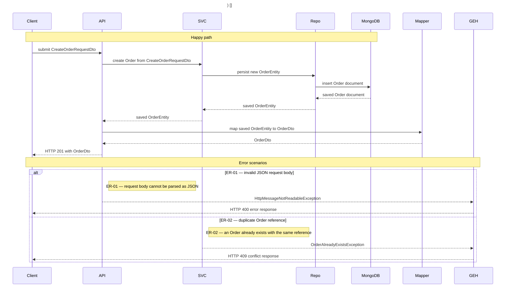

# Authoring Rules

Read by writer subagents (phase 3). All Hakash/Network/Channel/BroadcastPolicy/Order names below are **illustrative only** — replace them with the target service's real domain objects from the contract glossary.

## Before you start

You have been given flow numbers and `.hld-work/contract.md`. The contract is frozen:

- Use its **participant aliases verbatim**. Never invent an alias, never rename one.
- Use its **flow numbers and titles verbatim**.
- Look up exception handling in its **exception map**. Do not re-derive it.
- Look up DTO ownership in its **mapper/DTO ownership table**. Do not re-derive it.
- If the code contradicts the contract, do not silently deviate — record it in `contractViolations` in your receipt and use the code.

Order of work per flow: **Runtime Boundary → Runtime Trace → Error Trace → Mermaid → lint.**

## Batch complexity

Simple flows batch up to 5, medium 2–3, complex 1. A flow is **complex** if it involves: full details/enrichment · aggregation · clone · import/export · packaging · generation · synchronization · assignment · locking/unlocking · status transition · file/XML/JSON/ZIP handling · external integration · multiple repositories or validators · complex DTO/output construction · cross-aggregate mutation · in-memory state · several data sources.

## Scratch file

Write `.hld-work/flow-notes/<n>-<slug>.md`:

```markdown
# Flow <N> - <Name>

## Runtime Boundary
## Runtime Trace
## Error Trace
## Output Construction
## Storage / In-Memory / Config / External Data
## Mermaid
## Gaps
```

---

## 1. Runtime Boundary

Define this before tracing.

| Item | Value |
| ---- | ----- |
| Trigger type | |
| Entry point (file:line) | |
| Input data | |
| Success outcome | |
| Final output | |
| Response status/headers if HTTP | |
| Final boundary | |

HTTP starts at Client and ends at Client. Scheduler starts at Scheduler and ends at job completion/failure. Startup/shutdown end at success/failure. A message flow ends at its processing outcome; show ack/nack/retry/dead-letter only when the code proves it. **Never fake an HTTP status for a non-HTTP flow.**

---

## 2. Runtime Trace table

| RT ID | From | To | Operation | Data In | Data Out / Return | Evidence | Mermaid Required |
| ----- | ---- | -- | --------- | ------- | ----------------- | -------- | ---------------- |

- RT IDs sequential: `RT-01`, `RT-02`, …
- **`Evidence` must be `path/File.java:LINE`.** A row you cannot cite is a row you must not write. This is what makes the trace auditable and what drives refresh-mode change detection.
- Name every object passed between classes and every object returned from DB/storage/in-memory/external.
- `Mermaid Required` is `yes` except for the allowed omissions in §3.2.

### 3.1 Required rows

- **Boundary/trigger** — receive request / scheduled trigger / event / message; start startup or shutdown action; return final response or outcome.
- **Cross-class calls** — controller→service; service→service/helper/validator/repository/external client/parser/serializer; listener or job→service; any real component→another real component.
- **Same-class meaningful self-steps** (when no separate component exists) — resolve a child object from an aggregate; read from a map/list/set; update an aggregate; validate a business rule; check lock/token/ownership/status; calculate output that affects the response; build or enrich the response; anything that can throw.
- **Data access** — DB read/write/update/delete; repository/`MongoTemplate`/`JpaRepository`/`CrudRepository` call; cache get/put/evict; file read/write; in-memory `Map`/`List`/`Set`/field/`AtomicReference` read/write; behavior-affecting config or property read; external request and response.
- **Data movement** — request DTO / path / query / header passed to service; aggregate loaded from DB; child resolved from aggregate; in-memory value used in a decision; external response used in output; object mutated; saved document returned; DTO or response built and returned.
- **Output construction** — DTO built; mapper-owned DTO creation; `ResponseEntity` created; status/header/body set; file/message/event/artifact created; output enriched/filtered/sorted/grouped.

### 3.2 Allowed omissions — the complete list

Logger calls · simple getters/setters with no business meaning · Lombok-generated methods · pure constructor calls · local variable assignment · field-by-field copy steps **inside** a mapper (the mapper call and return arrows are still mandatory — see §7) · trivial null-safe formatting with no failure or business impact.

**Include everything else by default.** Do not use the word "meaningful" to justify a silent omission — an omission must match an item on this list.

### 3.3 Forbidden compression

Do not collapse a real chain into a shorter one. `Client→API→Service→Validator→Service→Repository→MongoDB→Repository→Service→self-steps→ExternalClient→…→API→Client` stays that long.

**Forbidden vague labels:** `process request` · `handle flow` · `perform logic` · `validate` · `get data` · `update entity` · `save data` · `return response` · `DB error` · `service error` · `validation error` · `exception`. Always use a specific action plus a specific data name.

---

## 3. Error Trace table

| ER ID | Source RT ID | Detection Point | Condition | Exact Error / Exception / Outcome | Handling / Propagation | Final Outcome | Evidence | Mermaid Required |
| ----- | ------------ | --------------- | --------- | --------------------------------- | ---------------------- | ------------- | -------- | ---------------- |

- ER IDs sequential. **Every RT row is checked for errors.**
- Every reachable `throw new` / `orElseThrow` / `catch` maps to an ER row or a documented exclusion.
- `Evidence` is `path/File.java:LINE`, same rule as the Runtime Trace.
- No speculative errors. No sample-only errors.

**Check at least:** invalid JSON body · unsupported content type · missing request body · missing path/query/header · enum or type conversion failure · `@Valid`/`@Validated` DTO validation annotations · controller manual validation · service business-rule exceptions · helper exceptions · lock/token/status/ownership exceptions · not found / missing child · duplicate or conflict · repository read/write/update/delete failures · DB exceptions · in-memory null or missing treated as an error · external 4xx/5xx/timeout/malformed response · parser/serializer/file exceptions · output-construction failures · caught-and-logged, caught-and-ignored, and wrapped-and-rethrown exceptions · handler mappings.

### Handling

Take handling from the contract's exception map. Possible values: specific `@ExceptionHandler` · `@ControllerAdvice` · local controller/service/helper handling · caught and logged · caught and ignored · converted to response · wrapped and rethrown · propagated unhandled · framework default · non-HTTP runtime failure.

### Grouping

Group errors into one branch only if **all** are true: same detection component, same handling path, same final outcome, no troubleshooting-critical detail hidden. A grouped branch must name **all** its ER IDs and exact error names.

```
Allowed:   else ER-02/ER-03 — @NotBlank name and @Size name validation fail
Forbidden: else Validation error · else DB error · else Service error · else Runtime exception
```

### Error branch detail

Branch labels describe the **real condition**, not just the wrapper exception. If one custom exception has several code-proven low-level causes, list them in parentheses. Preserve exact framework exception names, exact HTTP status, response body details (including empty body), and distinct handling outcomes as separate branches. Never merge timeout errors with generic DB errors when handler behavior differs.

```mermaid
else ER-07 — slot XML file missing/malformed
    Note right of BPS: ER-07 — slot definition XML cannot be read or parsed
    BPS-->>GEH: SlotParsingException (fileNotFound/mismatchedInput/invalidSyntax/IO)
    GEH-->>Client: HTTP 500 with error message
else ER-08 — MongoException during findById
    Note right of Repo: ER-08 — database read of the aggregate document fails
    Repo-->>GEH: MongoException
    GEH-->>Client: HTTP 500 with error message
else ER-09 — MongoTimeoutException during findById
    Note right of Repo: ER-09 — database unreachable while reading the aggregate document
    Repo-->>GEH: MongoTimeoutException
    GEH-->>Client: HTTP 503 Database is currently unavailable
end
```

Include exact causes when the code proves them. **File/parser:** fileNotFound, accessDenied, invalid path, mismatchedInput, invalidSyntax, `JsonParseException`, `IOException`, XML mapping failure, malformed content. **DB (separate branches when handling differs):** `MongoException`, `MongoTimeoutException`, `DataAccessException`, duplicate key, write failure, read failure. **Validation:** exact field plus rule (`@NotBlank hakashId`, missing required header, invalid enum, `MethodArgumentNotValidException`, `HandlerMethodValidationException`). **Not found:** exact final response (`HTTP 404 Not Found (empty body)`).

Never replace specific causes with `read/parse failed`, `DB query fails`, `validation failed`, or `service error`.

### Error branch title notes

Every `alt` and every `else` error branch opens with a title note, so a reader scanning the diagram knows the failure case before reading any arrow.

- The **first line inside every `alt` and every `else` error branch** is `Note right of <participant>: ER-xx — <what failed>`, followed by the branch arrows.
- Use `Note right of`, never `Note over`. `Note over` spans participants and renders a wide background band; that band is reserved for the two section titles (`Note over ...: Happy path` and `Note over ...: Error scenarios`).
- Anchor the note to the participant that **detects** the failure — the one that throws or propagates it. It must be a declared participant.
- The title states the **scenario or the thing that failed** in domain terms — not the wrapper exception alone, not a generic word.
- Keep the descriptive `alt`/`else` branch label as well. The note is additional, not a replacement.
- Grouped branches title all their ER IDs: `Note right of API: ER-04/ER-05 — required request fields fail validation`.
- Note text obeys the same label-safety rules as arrows — no `->`, `-->`, `->>`, `-->>`, no Java signatures.

```mermaid
alt ER-01 — invalid JSON request body
    Note right of API: ER-01 — request body cannot be parsed as JSON
    API-->>GEH: HttpMessageNotReadableException
    GEH-->>Client: HTTP 400 error response
else ER-02 — Order not found for orderId
    Note right of SVC: ER-02 — no Order document exists for the requested orderId
    SVC-->>GEH: OrderNotFoundException
    GEH-->>Client: HTTP 404 Not Found (empty body)
else ER-03 — MongoTimeoutException during findById
    Note right of Repo: ER-03 — database unreachable while loading the Order document
    Repo-->>GEH: MongoTimeoutException
    GEH-->>Client: HTTP 503 Database is currently unavailable
end
```

Forbidden titles: `Note right of ...: error` · `: failure` · `: exception` · `: ER-05` (ID with no description) · `: validation error` · `: DB error`. Also forbidden: `Note over A,B: ER-xx — ...`.

`scripts/lint_hld.py` enforces the mechanical part of this rule. It does not judge whether your description is meaningful — that is on you.

---

## 4. Data naming

Arrow and return labels must name real data, using the contract glossary's domain names.

| | |
|---|---|
| **Good** | `submit CreateHakashRequestDto` · `load Hakash aggregate by id` · `read NetworkEntity from Hakash.networks by networkId` · `verify lock token against Hakash.lockInfo` · `persist updated Hakash document` · `return HTTP 200 with HakashDto and headers` |
| **Bad** | `process request` · `get entity` · `update` · `save` · `return response` · `handle error` · `DB error` |

---

## 5. Happy path — detailed but success-only

Keep full Runtime Trace detail: loops, parser/serializer steps, FileSystem steps, DB-specific behavior. The **only** correction versus the trace is that a Happy-path label must not mention the failed alternative. Failed alternatives live only in Error scenarios.

Forbidden inside Happy-path labels: `(else ...)`, `(otherwise ...)`, `else return 404`, `else throw ...`, `if missing`, `if invalid`, `if failed`, `not found`, `error`, `exception`, `failure`, `failed`.

Do not fix this by deleting the step — keep it and rewrite with success-only wording:

```mermaid
%% Bad
API->>API: check Optional present (else return 404)
SVC->>SVC: verify lock token (else throw LockException)
%% Good
API->>API: unwrap present HakashEntity from Optional
SVC->>SVC: verify lock token matches lockInfo
```

When removing failure wording, **do not remove any successful runtime detail** — path variable names, repository return type, DTO construction, loops, external/file/parser calls, final HTTP status. Do not downgrade specificity or merge exact errors into generic ones.

---

## 6. HLD filter — omit low-value technical control flow

The Happy path must not show low-value success-only steps that add nothing to architectural understanding. Do **not** add arrows for: unwrap/check/get `Optional`, null-check success, generic "confirm present" / "check exists", simple boolean-guard success, local variable assignment, collection-iteration setup, trivial object allocation.

These steps are still **analyzed for errors** — they just do not appear as standalone Happy-path arrows unless they carry business meaning, data movement, storage/external access, output construction, or troubleshooting value. When code returns `Optional<T>`, record it in the trace but present the resolved business object in Mermaid:

```mermaid
Repo-->>SVC: HakashEntity
SVC-->>API: HakashEntity
API->>API: build HakashFullDetailsDto from HakashEntity networks and channels
```

---

## 7. Label quality — compact but specific

One runtime action per label, in domain language. Prefer 3–10 words; ideal under 70 characters, acceptable under 100; over ~90 either split the arrow or move detail into the flow's *Primary Runtime/Data Movement* section. Never join multiple actions with semicolons — split into several arrows.

Every label should answer at least two of: what object is used · what object is produced · what key or id is used · what domain rule is checked · what state changes · what component owns the work.

Compact does not mean cryptic. Keep the domain object name and the lookup or rule meaning. Replace generic nouns: `aggregate` → the real aggregate name; `entity` → the real entity; `item` → the real child; `response` → the real DTO; `validate` → the real rule.

```mermaid
%% Bad (vague) then Good (specific)
SVC->>SVC: resolve network
SVC->>SVC: find NetworkEntity by networkId
SVC->>SVC: validate
SVC->>SVC: check lock token and status
SVC->>SVC: update aggregate
SVC->>SVC: add ChannelEntity to NetworkEntity
API->>API: build response
API->>Mapper: map NetworkEntity to NetworkDto
```

If a label would be too long, split it:

```mermaid
SVC->>SVC: calculate next sequence number by channel type
SVC->>SVC: set sequenceNumber on ChannelEntity
SVC->>SVC: add ChannelEntity to NetworkEntity channels map
```

---

## 8. Mermaid / Excalidraw syntax safety

Generated Mermaid must parse and import into Excalidraw. A diagram that fails to import is a failed diagram, and phase 5 will catch it.

**Never put these tokens inside arrow, return, or note labels:** `->`, `-->`, `->>`, `-->>`, `<-`, `<--`, `<<`, `>>`, raw Java lambda arrows, raw transition arrows.

**Avoid parser-risk content:** semicolon-heavy chains, raw method calls with many parentheses, Java generic-heavy signatures, nested parentheses, unescaped quotes, raw code expressions, `a -> b`, `condition ? a : b`. Prefer natural language.

```mermaid
%% Bad
API->>API: toChannel(channel) then setBroadcastPolicy then toUserDetails
BPS->>XML: readValue(xmlFile, BroadcastPolicyWithSlotsXml)
%% Good
API->>API: create ChannelEntity from CreateChannelRequestDto
API->>API: attach BroadcastPolicyEntity to ChannelEntity
BPS->>XML: parse XML file into BroadcastPolicyWithSlotsXml
```

---

## 9. Notes, method names, duplicate output

- **No internal resolved-state notes.** Forbidden: `Note right of ...: resolved HakashEntity`, `Optional value present`, `validation passed`, `object mapped`, trivial-mapping or local-variable notes, or a note compensating for a bad label. If resolved data matters, show it via the return arrow or the next business step.

  **Allowed notes — the complete list:** `Note over ...: Happy path` · `Note over ...: Error scenarios` · the per-error `Note right of <participant>: ER-xx — <what failed>` title · a note explaining a real architectural boundary that arrows cannot express · a note documenting a real gap or ambiguity.

- **Never use a note or bare text where an arrow belongs.** A note documents; it does not represent a runtime operation.

- **No mapper or helper method-name arrows.** This is about *labels*, not about hiding the Mapper — the Mapper participant and its arrows are mandatory (§10), but the label describes behavior, never the method name. Forbidden labels: `toHakashFullDetailsDto(...)`, `toDto(entity)`, `mapToResponse(...)`, `convert(...)`, `buildDto(...)`. Do not create an extra self-arrow just because a private conversion helper exists — show the real data being assembled, or the helper's real internal operations:

```mermaid
loop for each channel broadcast policy
    Mapper->>BPS: load slot definitions for broadcastPolicyId
    BPS-->>Mapper: List of SlotXml slots
end
Mapper->>Mapper: assemble HakashFullDetailsDto with networks, channels, and slots
```

- **No duplicate output construction.** Do not show both a conversion-helper call and a behavior-rich build step — keep only the behavior-rich one. The scratch trace may record the exact helper method as evidence; Mermaid renders behavior.

---

## 10. Mapper participation and ownership

**Mandatory inclusion.** If the runtime of a flow enters a mapper class or interface, the Mapper **is** a declared participant and its call and return are Mermaid arrows. This is unconditional — it applies to pure field-copy mapping, list mapping, nested mapping, and derived-field mapping alike. Never drop a Mapper to shorten a diagram, and never hide it because the mapping "looks trivial".

Attribute every output/DTO-construction step to the class that **actually performs it**, per the contract's ownership table. This overrides the compact-label rule — never hide a Mapper to shorten a label.

**Ownership gate.** Before writing any `API->>API: build XxxDto`, `SVC->>SVC: build XxxDto`, or `assemble ResponseDto`, look the DTO up in the contract's Mapper/DTO Ownership table. If a mapper owns it, the mapper is the Mermaid owner. If the DTO is missing from the table, read the code, decide, and record it in `contractViolations`.

**Depth scales with behavior; presence is always required:**

- **Pure field-copy mapper** — show exactly the call arrow and the return arrow, no internal mapper self-arrows.
- **Non-trivial mapper** — additionally show its internal work as self-arrows or outgoing calls.

```mermaid
%% Non-trivial mapper — show it as owner and show its real work
SVC-->>API: edited NetworkEntity
API->>Mapper: map NetworkEntity to NetworkDto
Mapper->>Mapper: map channel summaries
Mapper-->>API: NetworkDto
API-->>Client: HTTP 200 with NetworkDto

%% Pure field-copy mapper — still shown, just call and return
SVC-->>API: saved OrderEntity
API->>Mapper: map OrderEntity to OrderDto
Mapper-->>API: OrderDto
API-->>Client: HTTP 200 with OrderDto
```

Show `API->>Mapper` or `SVC->>Mapper` per the real caller. If a mapper calls another component, show the mapper as caller (`Mapper->>BPS: load slot definitions for broadcastPolicyId`, `Mapper->>Config: read output mapping configuration`). If a mapper can throw, its errors appear in the Error Trace with the mapper as detection point. Never attribute mapper-owned work to Controller or Service.

---

## 11. Self-arrows, storage, in-memory and config

**Self-arrows must be real arrows.** A same-class step is written as `X->>X: <action>` (and `X-->>X: <returned data>` when a return matters). Never render a self-step as a note, a bare text line, a comment, or extra words appended to a neighbouring arrow's label.

```mermaid
%% Bad — self-step drawn as a note, so no arrow is rendered
Note right of SVC: verify lock token matches lockInfo
%% Good — real self-arrow
SVC->>SVC: verify lock token matches lockInfo
SVC->>SVC: calculate next sequence number by channel type
```

Self-arrows are **required** when the same class reads a child from an aggregate/map/list, updates an aggregate or child, checks a business rule, checks lock/token/status/ownership, builds meaningful output, computes derived response data, or can throw. Not for trivial getters/setters/logging/local variables or purely technical `Optional`/null-check success.

**Storage / DB** — show both request and return; name what is written and what returns or acks; a read result used later must appear by name.

```mermaid
SVC->>Repo: load Hakash aggregate by id
Repo->>MongoDB: find Hakash document by id
MongoDB-->>Repo: Hakash document
Repo-->>SVC: Hakash aggregate with networks map
```

A repository is not automatically a database. An entity is not automatically persisted. Show `MongoDB` only where the Mongo-backed path is proven. Never show in-memory state as a database. Never invent an operation.

**In-memory / config / cache** — show behavior-affecting reads and writes. Config access appears when it changes decisions, TTLs, endpoints, limits, statuses, or output. Cache shows get/put/evict plus the returned value. Do not hide in-memory data behind "service logic".

```mermaid
SVC->>SVC: read channels map from NetworkEntity
SVC-->>SVC: Map of channelId to ChannelEntity
SVC->>Config: read lock TTL configuration
Config-->>SVC: lockTTL duration
```

---

## 12. Participants

**Allowed when code-proven:** Client · API/Controller · Service · Validator · Helper · Repository · MongoDB/SQL/Redis/FileSystem/Cache/InMemoryState/Config · External Service · Scheduler · Listener/Consumer · Producer · Broker/Queue/Topic · Initializer · GlobalExceptionHandler/ControllerAdvice · Parser/Serializer · Mapper · Audit component.

**Forbidden:** invented managers or orchestrators · a DB/cache the code does not reach · a DTO as a participant · an entity as a participant · omitting a Mapper the flow enters.

Aliases come from the contract, declared as `API as HakashController`, `SVC as HakashService`, `Repo as HakashRepository`, `State as InMemoryState`, `Config as AppConfig`, `GEH as GlobalExceptionHandler`, `Mapper as <ActualMapperClass>`.

---

## 13. Mermaid block structure

Exactly one Mermaid block per flow.



Structural requirements: every required RT ID appears as a `%% RT-xx` comment · every required ER ID appears in an error-branch label · Happy path first, Error scenarios second · the success path is never inside an `else` · one block per flow · no separate error diagram · every fence closed · every `loop`/`alt`/`else`/`end` balanced · every referenced participant declared.

---

## 14. Before you return

Run the linter on your own file and fix everything it reports:

```
python "$SKILL/scripts/lint_hld.py" .hld-work/flow-notes/<n>-<slug>.md
```

Then self-check against `references/validation.md`. Return a receipt only:

```json
{ "flow": 3, "slug": "create-order", "rtCount": 14, "erCount": 6,
  "participants": ["Client","API","SVC","Repo","MongoDB","Mapper","GEH"],
  "sourceFiles": ["src/main/java/com/x/OrderController.java", "src/main/java/com/x/OrderService.java"],
  "contractViolations": [], "gaps": [], "lint": "pass" }
```

Never return the diagram body.
